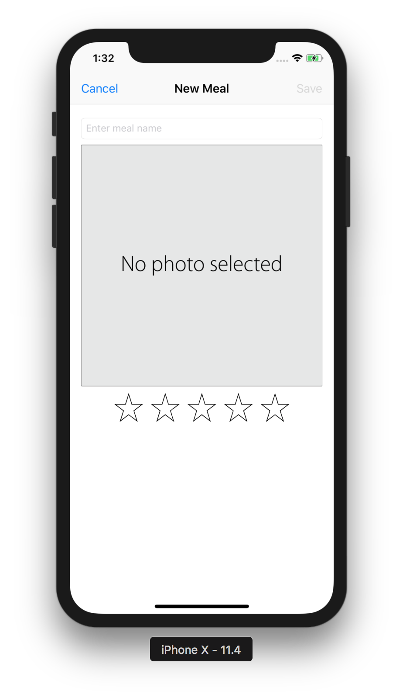

# iOS_Tutorial_FoodTracker-master
## 简介
iOS(Swift) 官方教程
## 文件结构
```
.
├── .DS_Store
├── .git
│   ├── HEAD
│   ├── branches
│   ├── config
│   ├── description
│   ├── hooks
│   │   ├── applypatch-msg.sample
│   │   ├── commit-msg.sample
│   │   ├── fsmonitor-watchman.sample
│   │   ├── post-update.sample
│   │   ├── pre-applypatch.sample
│   │   ├── pre-commit.sample
│   │   ├── pre-push.sample
│   │   ├── pre-rebase.sample
│   │   ├── pre-receive.sample
│   │   ├── prepare-commit-msg.sample
│   │   └── update.sample
│   ├── info
│   │   └── exclude
│   ├── objects
│   │   ├── info
│   │   └── pack
│   └── refs
│       ├── heads
│       └── tags
├── FoodTracker
│   ├── .git
│   │   ├── COMMIT_EDITMSG
│   │   ├── HEAD
│   │   ├── config
│   │   ├── description
│   │   ├── hooks
│   │   │   └── README.sample
│   │   ├── index
│   │   ├── info
│   │   │   └── exclude
│   │   ├── logs
│   │   │   ├── HEAD
│   │   │   └── refs
│   │   │       └── heads
│   │   │           └── master
│   │   ├── objects
:   :   :
│   │   └── refs
│   │       ├── heads
│   │       │   └── master
│   │       └── tags
│   ├── .idea
│   │   ├── FoodTracker.iml
│   │   ├── inspectionProfiles
│   │   │   └── profiles_settings.xml
│   │   ├── misc.xml
│   │   ├── modules.xml
│   │   └── workspace.xml
│   ├── FoodTracker
│   │   ├── AppDelegate.swift                       # 代表文件
│   │   ├── Assets.xcassets                         # 资源
│   │   │   ├── AppIcon.appiconset
│   │   │   │   └── Contents.json
│   │   │   ├── Contents.json
│   │   │   ├── Rating\ Images
│   │   │   │   ├── Contents.json
│   │   │   │   ├── emptyStar.imageset
│   │   │   │   │   ├── Contents.json
│   │   │   │   │   └── emptyStar.png               # 空星星
│   │   │   │   ├── filledStar.imageset
│   │   │   │   │   ├── Contents.json
│   │   │   │   │   └── filledStar.png              # 满星星
│   │   │   │   └── highlightedStar.imageset
│   │   │   │       ├── Contents.json
│   │   │   │       └── highlightedStar.png         # 高亮星
│   │   │   ├── Sample\ Images                      # 餐例图片
│   │   │   │   ├── Contents.json
│   │   │   │   ├── meal1.imageset
│   │   │   │   │   ├── Contents.json
│   │   │   │   │   └── meal1.png 
│   │   │   │   ├── meal2.imageset
│   │   │   │   │   ├── Contents.json
│   │   │   │   │   └── meal2.png
│   │   │   │   └── meal3.imageset
│   │   │   │       ├── Contents.json
│   │   │   │       └── meal3.png
│   │   │   ├── defaultPhoto.imageset               # 默认待选图片
│   │   │   │   ├── Contents.json
│   │   │   │   └── defaultPhoto.png
│   │   │   └── defaultPhoto_mine.imageset
│   │   │       ├── 16sucai_p20161118009_04e.jpg
│   │   │       └── Contents.json
│   │   ├── Base.lproj                              # 启动页面
│   │   │   ├── LaunchScreen.storyboard
│   │   │   └── Main.storyboard
│   │   ├── Info.plist                              # 项目配置文件
│   │   ├── Meal.swift                              # Meal 控制类
│   │   ├── MealTableViewCell.swift
│   │   ├── MealTableViewController.swift
│   │   ├── MealViewController.swift
│   │   └── RatingControl.swift                     # 评级文件
│   ├── FoodTracker.xcodeproj
│   │   ├── project.pbxproj
│   │   ├── project.xcworkspace
│   │   │   ├── contents.xcworkspacedata
│   │   │   ├── xcshareddata
│   │   │   │   └── IDEWorkspaceChecks.plist
│   │   │   └── xcuserdata
│   │   │       └── lightwingng.xcuserdatad
│   │   │           └── UserInterfaceState.xcuserstate
│   │   └── xcuserdata
│   │       └── lightwingng.xcuserdatad
│   │           └── xcschemes
│   │               └── xcschememanagement.plist
│   └── FoodTrackerTests
│       ├── FoodTrackerTests.swift
│       └── Info.plist
├── Images                                          # 截图 
│   ├── Adding.png
│   ├── Detail.png
│   ├── Edit.png
│   └── Main.png
└── README.md
```
## 运行效果(iPhone X)

<center> Main Page after Launch </center>

<center> Check the Meal Menu </center>

<center> Edit if necessary </center>

<center> Add if necessary </center>
## 读书笔记
### Developer
### Start Developing iOS Apps (Swift)

* Getting Started
    * Jump Right In

* Building the UI
    * Build a Basic UI


    * Connect the UI to Code


    * Work with View Controllers


    * Implement a Custom Control


    * Define Your Data Model

* Working with Table Views
    * Create a Table View


    * Implement Navigation


    * Implement Edit and Delete Behavior


    * Persist Data

* What’s Next?
    * Where to Go from Here

* iOS and Swift Terminology
    * Glossary

* Revision History
    * Document Revision History

